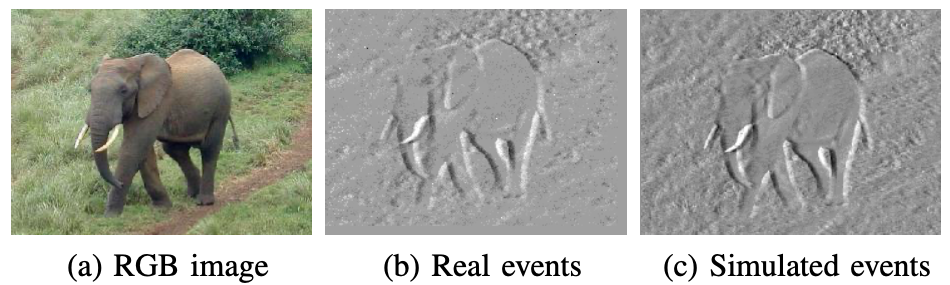
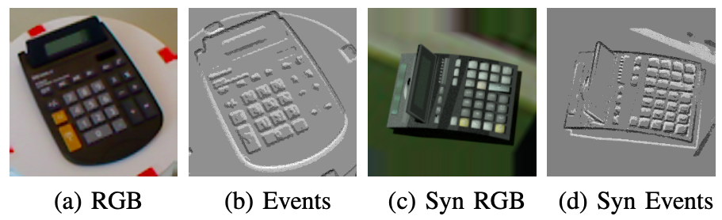
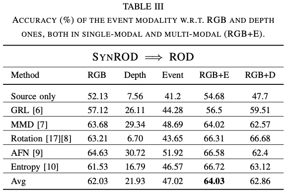

# DA4Event

### Introduction
This repository contains the implementation of the model presented in the following paper:

> **DA4Event: towards bridging the Sim-to-Real Gap for Event Cameras using Domain Adaptation**, Mirco Planamente, Chiara Plizzari, Marco Cannici, Marco Ciccone, Francesco Strada, Andrea Bottino, Matteo Matteucci, Barbara Caputo [ArXiv](https://arxiv.org/abs/2103.12768)

### Prerequisites
- Python3
- [PyTorch](http://pytorch.org) 1.6

### Code
Coming soon

### Datasets
Here are described the procedure to reproduce our datasets. Please contact us if you want to have direct access to them. 

#### N-Caltech101

*Real N-Caltech*: the Neuromorphic Caltech101 ([N-Caltech101](https://www.frontiersin.org/articles/10.3389/fnins.2015.00437/full)) is an event-based conversion of the popular image dataset [Caltech101](https://dl.acm.org/doi/10.1109/TPAMI.2006.79). 

*Sim N-Caltech*: we used the event simulator [ESIM](http://rpg.ifi.uzh.ch/docs/CORL18_Rebecq.pdf) to extract the simulated event streams from Caltech101 RGB images. The conversion from still images to video sequences has been done following [Video-to-Events](http://rpg.ifi.uzh.ch/docs/arXiv19_Gehrig_vid.pdf).

### RGB-D Object Dataset (ROD)

*RGB-E Real ROD*: the RGB-D Object Dataset ([ROD](https://rse-lab.cs.washington.edu/postscripts/rgbd-dataset-icra-11.pdf)) is one of the most common benchmarks for object recognition in robotics. We extended it to the event modality by converting the crops provided in [RGB-crops](https://data.acin.tuwien.ac.at/index.php/s/YKZQmoRtWaAcU91) to events, following the procedure in [Video-to-Events](http://rpg.ifi.uzh.ch/docs/arXiv19_Gehrig_vid.pdf) and using [ESIM](http://rpg.ifi.uzh.ch/docs/CORL18_Rebecq.pdf) simulator.

*RGB-E Syn ROD*: a synthetic version of ROD (synROD) has been recently proposed in [synROD](https://arxiv.org/pdf/2004.10016.pdf). We converted the crops provided in [syn-RGB-crops](https://data.acin.tuwien.ac.at/index.php/s/u4KuUVlUnkkzxhd) to events with the same procedure described above, obtaining a synthetic event version.

## Results
### N-Caltech101 

### ROD 

### Citation 
Please cite the following paper if you use this code for your researches:

<pre><code> @misc{planamente2021da4event,
      title={DA4Event: towards bridging the Sim-to-Real Gap for Event Cameras using Domain Adaptation}, 
      author={Mirco Planamente and Chiara Plizzari and Marco Cannici and Marco Ciccone and Francesco Strada and Andrea Bottino and Matteo Matteucci and Barbara Caputo},
      year={2021},
      eprint={2103.12768},
      archivePrefix={arXiv},
      primaryClass={cs.CV}
}
</pre></code>

## Contact :pushpin:
If you have any question, do not hesitate to contact us:
- Mirco Planamente: <code> mirco.planamente@polito.it</code>
- Chiara Plizzari: <code> chiara.plizzari@polito.it</code>
- Marco Cannici: <code> marco.cannici@polimi.it</code>
